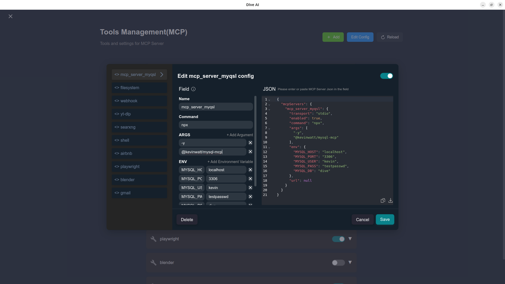

# Dive AI Agent 🤿 🤖


[](https://discord.com/invite/qceMERf4y2)
[](https://twitter.com/Dive_ai_agent)

Dive is an open-source MCP Host Desktop Application that seamlessly integrates with any LLMs supporting function calling capabilities. ✨


## Features 🎯

- 🌐 **Universal LLM Support**: Compatible with ChatGPT, Anthropic, Ollama and OpenAI-compatible models
- 💻 **Cross-Platform**: Available for Windows, MacOS, and Linux
- 🔄 **Model Context Protocol**: Enabling seamless MCP AI agent integration on both stdio and SSE mode
- ☁️ **OAP Cloud Integration**: One-click access to managed MCP servers via [OAPHub.ai](https://oaphub.ai/) - eliminates complex local deployments
- 🏗️ **Dual Architecture**: Modern Tauri version alongside traditional Electron version for optimal performance
- 🌍 **Multi-Language Support**: Traditional Chinese, Simplified Chinese, English, Spanish, Japanese, Korean with more coming soon
- ⚙️ **Advanced API Management**: Multiple API keys and model switching support with `model_settings.json`
- 🛠️ **Granular Tool Control**: Enable/disable individual MCP tools for precise customization
- 💡 **Custom Instructions**: Personalized system prompts for tailored AI behavior
- 🔄 **Auto-Update Mechanism**: Automatically checks for and installs the latest application updates

## Recent updates(2025/7/31) - v0.9.0 🎉

### Major Architecture Changes
- 🏗️ **Dual Architecture Support**: Dive now supports both **Electron** and **Tauri** frameworks simultaneously
- ⚡ **Tauri Version**: New modern architecture with optimized installer size (Windows < 30MB)
- 🌐 **OAP Platform Integration**: Native support for [OAPHub.ai](https://oaphub.ai/) cloud services with one-click MCP server deployment

### New Features & Improvements
- 🔐 **OAP Authentication**: Comprehensive OAP login and authentication support
- 📁 **Enhanced Model Configuration**: Complete restructuring with `model_settings.json` for managing multiple models
- 🛠️ **Granular MCP Control**: Individual tool enable/disable functionality for better customization
- 🎨 **UI/UX Enhancements**: Various interface improvements across the application
- 🔄 **Updated dive-mcp-host**: Latest architectural improvements incorporated

### Platform Availability
- **Windows**: Available in both Electron and Tauri versions ✅
- **macOS**: Currently Electron only 🔜
- **Linux**: Currently Electron only 🔜

> **Migration Note:** Existing local MCP/LLM configurations remain fully supported. OAP integration is additive and does not affect current workflows.

## Download and Install ⬇️

Get the latest version of Dive:
[](https://github.com/OpenAgentPlatform/Dive/releases/latest)

### Windows users: 🪟
Choose between two architectures:
- **Tauri Version** (Recommended): Smaller installer (<30MB), modern architecture
- **Electron Version**: Traditional architecture, fully stable
- Python and Node.js environments will be downloaded automatically after launching

### MacOS users: 🍎
- **Electron Version**: Download the .dmg version
- You need to install Python and Node.js (with npx uvx) environments yourself
- Follow the installation prompts to complete setup

### Linux users: 🐧
- **Electron Version**: Download the .AppImage version
- You need to install Python and Node.js (with npx uvx) environments yourself
- For Ubuntu/Debian users:
  - You may need to add `--no-sandbox` parameter
  - Or modify system settings to allow sandbox
  - Run `chmod +x` to make the AppImage executable

## MCP Setup Options

Dive offers two ways to access MCP tools: **OAP Cloud Services** (recommended for beginners) and **Local MCP Servers** (for advanced users).

### Option 1: Local MCP Servers 🛠️

For advanced users who prefer local control. The system comes with a default echo MCP Server, and you can add more powerful tools like Fetch and Youtube-dl.



### Option 2: OAP Cloud Services ☁️

The easiest way to get started! Access enterprise-grade MCP tools instantly:

1. **Sign up** at [OAPHub.ai](https://oaphub.ai/) 
2. **Connect** to Dive using one-click deep links or configuration files
3. **Enjoy** managed MCP servers with zero setup - no Python, Docker, or complex dependencies required

Benefits:
- ✅ Zero configuration needed
- ✅ Cross-platform compatibility
- ✅ Enterprise-grade reliability
- ✅ Automatic updates and maintenance


#### Quick Local Setup

Add this JSON configuration to your Dive MCP settings to enable local tools:

```json
 "mcpServers":{
    "fetch": {
      "command": "uvx",
      "args": [
        "mcp-server-fetch",
        "--ignore-robots-txt"
      ],
      "enabled": true
    },
    "filesystem": {
      "command": "npx",
      "args": [
        "-y",
        "@modelcontextprotocol/server-filesystem",
        "/path/to/allowed/files"
      ],
      "enabled": true
    },
    "youtubedl": {
      "command": "npx",
      "args": [
        "@kevinwatt/yt-dlp-mcp"
      ],
      "enabled": true
    }
  }
```

#### Using Streamable HTTP for Cloud MCP Services

You can connect to external cloud MCP servers via Streamable HTTP transport. Here's the Dive configuration example for SearXNG service from OAPHub:

```json
{
  "mcpServers": {
    "SearXNG_MCP_Server": {
      "transport": "streamable",
      "url": "https://proxy.oaphub.ai/v1/mcp/181672830075666436",
      "headers": {
        "Authorization": "GLOBAL_CLIENT_TOKEN"
      }
    }
  }
}
```

Reference: [@https://oaphub.ai/mcp/181672830075666436](https://oaphub.ai/mcp/181672830075666436)

#### Using SSE Server (Non-Local MCP)

You can also connect to external MCP servers (not local ones) via SSE (Server-Sent Events). Add this configuration to your Dive MCP settings:

```json
{
  "mcpServers": {
    "MCP_SERVER_NAME": {
      "enabled": true,
      "transport": "sse",
      "url": "YOUR_SSE_SERVER_URL"
    }
  }
}
```

#### Additional Setup for yt-dlp-mcp

yt-dlp-mcp requires the yt-dlp package. Install it based on your operating system:

#### Windows
```bash
winget install yt-dlp
```

#### MacOS
```bash
brew install yt-dlp
```

#### Linux
```bash
pip install yt-dlp
```

## Build 🛠️

See [BUILD.md](BUILD.md) for more details.

## Connect With Us 🌐
- 💬 Join our [Discord](https://discord.com/invite/qceMERf4y2)
- 🐦 Follow us on [Twitter/X](https://x.com/Dive_ai_agent) [Reddit](https://www.reddit.com/user/BigGo_official/) [Thread](https://www.threads.net/@dive_mcpserver)
- ⭐ Star us on GitHub
- 🐛 Report issues on our [Issue Tracker](https://github.com/OpenAgentPlatform/Dive/issues)


