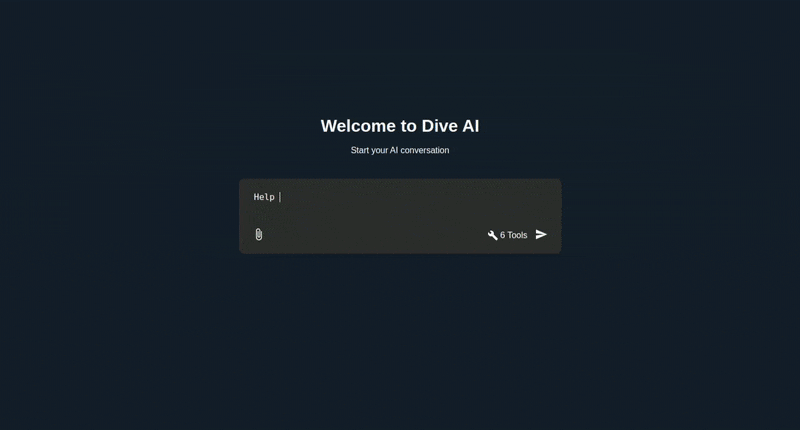
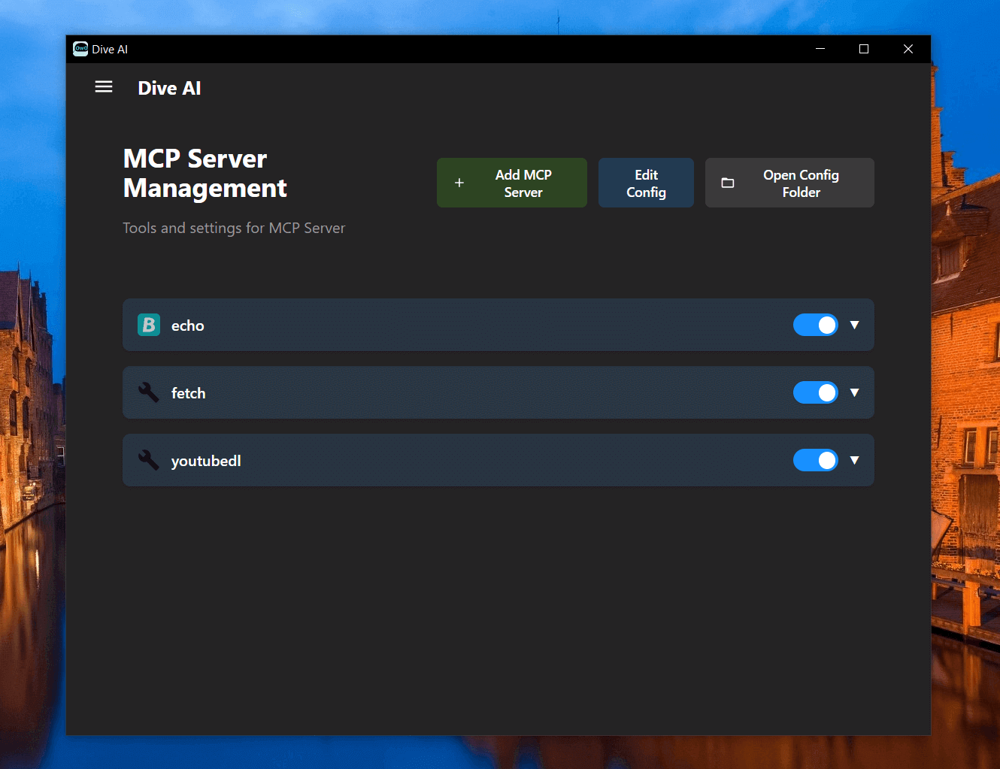

# Dive AI Agent 🤿 🤖


[](https://discord.gg/jact84GwGh)
[](https://twitter.com/Dive_ai_agent)


Dive is an open-source AI Agent desktop application that seamlessly integrates any Tools Call-supported LLM with frontend MCP Server—part of the Open Agent Platform initiative. ✨




## Features 🎯

- 🌐 **Universal LLM Support**: Compatible with ChatGPT, Anthropic, Ollama and OpenAI-compatible models
- 💻 **Cross-Platform**: Available for Windows, MacOS, and Linux
- 🔄 **Model Context Protocol**: Enabling seamless AI agent integration
- 🔌 **MCP Server Integration**: External data access and processing capabilities
- 🌍 **Multi-Language Support**: Traditional Chinese, English, with more coming soon
- ⚙️ **Advanced API Management**: Multiple API keys and model switching support
- 💡 **Custom Instructions**: Personalized system prompts for tailored AI behavior
- 💬 **Intuitive Chat Interface**: Real-time context management and user-friendly design

- 🚀 **Upcoming Features**: Prompt Schedule and OpenAgentPlatform MarketPlace

## Download and Install ⬇️

Get the latest version of Dive:
[](https://github.com/OpenAgentPlatform/Dive/releases/latest)

For Windows users: 🪟
- Download the .exe version
- Python and Node.js environments are pre-installed

For MacOS users: 🍎
- Download the .dmg version
- You need to install Python and Node.js (with npx uvx) environments yourself
- Follow the installation prompts to complete setup

For Linux users: 🐧
- Download the .AppImage version
- You need to install Python and Node.js (with npx uvx) environments yourself
- For Ubuntu/Debian users:
  - You may need to add `--no-sandbox` parameter
  - Or modify system settings to allow sandbox
  - Run `chmod +x` to make the AppImage executable

## MCP Tips

While the system comes with a default echo MCP Server, your LLM can access more powerful tools through MCP. Here's how to get started with two beginner-friendly tools: Fetch and Youtube-dl.




### Quick Setup

Add this JSON configuration to your Dive MCP settings to enable both tools:

```json
 "mcpServers":{
    "fetch": {
      "command": "uvx",
      "args": [
        "mcp-server-fetch",
        "--ignore-robots-txt"
      ],
      "enabled": true
    },
    "youtubedl": {
      "command": "npx",
      "args": [
        "@kevinwatt/yt-dlp-mcp"
      ],
      "enabled": true
    }
  }
```

### Using SSE Server for MCP

You can also connect to an external MCP server via SSE (Server-Sent Events). Add this configuration to your Dive MCP settings:

```json
{
  "mcpServers": {
    "MCP_SERVER_NAME": {
      "enabled": true,
      "transport": "sse",
      "url": "YOUR_SSE_SERVER_URL"
    }
  }
}
```

### Additional Setup for yt-dlp-mcp

yt-dlp-mcp requires the yt-dlp package. Install it based on your operating system:

#### Windows
```bash
winget install yt-dlp
```

#### MacOS
```bash
brew install yt-dlp
```

#### Linux
```bash
pip install yt-dlp
```

## Build 🛠️

See [BUILD.md](BUILD.md) for more details.

## Connect With Us 🌐
- 💬 Join our [Discord](https://discord.gg/qceMERf4y2)
- 🐦 Follow us on [Twitter/X](https://x.com/Dive_ai_agent)
- ⭐ Star us on GitHub
- 🐛 Report issues on our [Issue Tracker](https://github.com/OpenAgentPlatform/Dive/issues)


